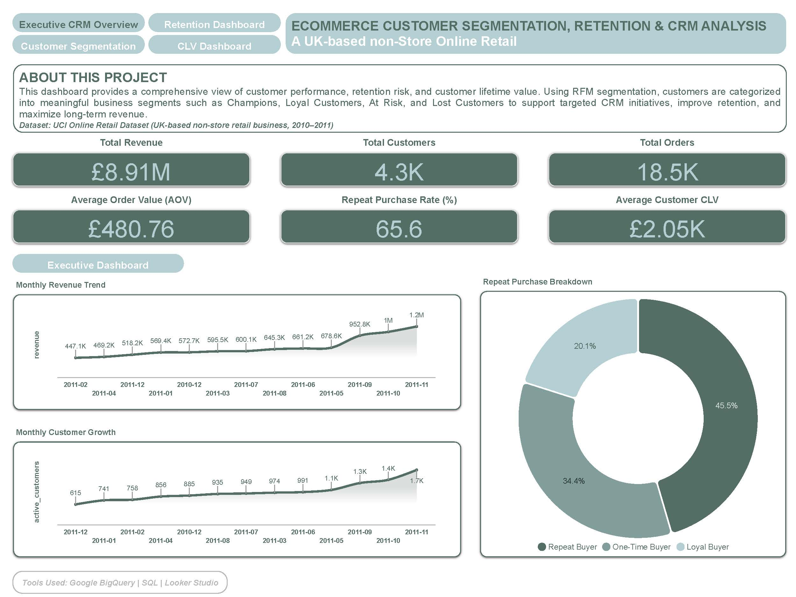
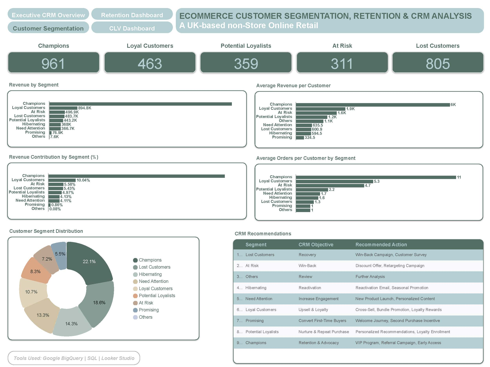
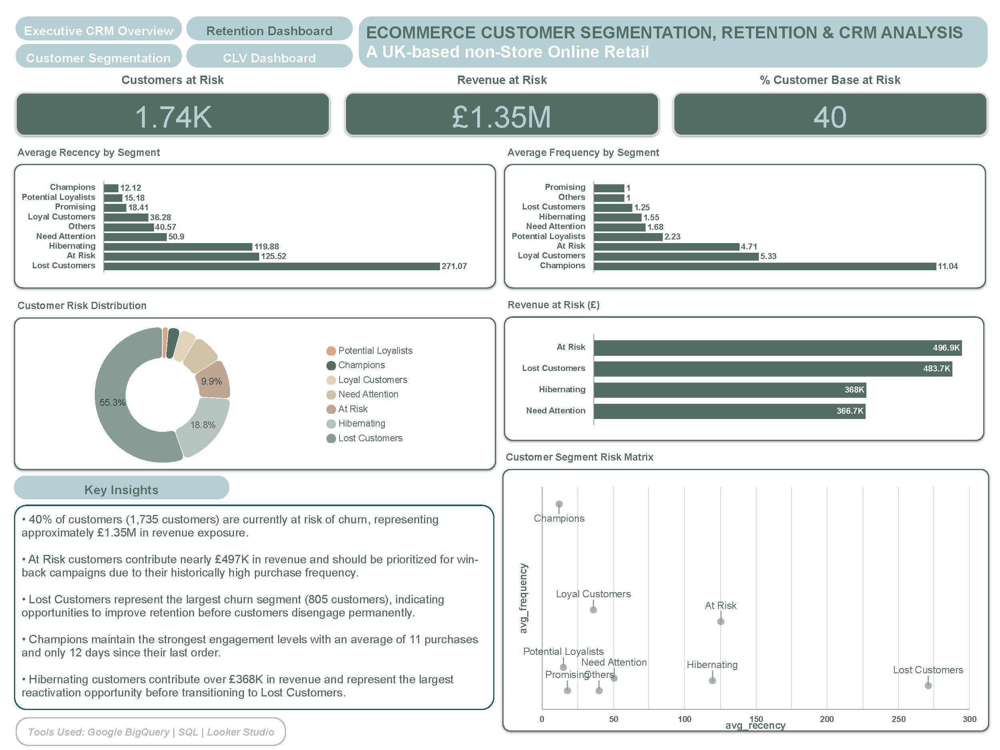
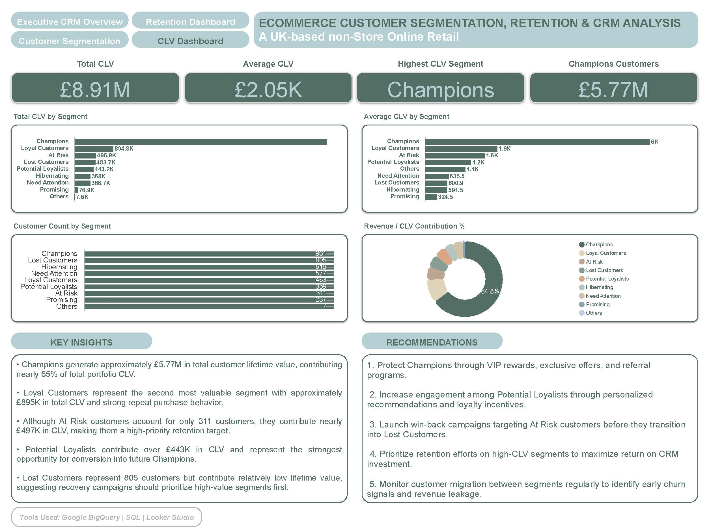

# Ecommerce Customer Segmentation, Retention & CRM Analysis

## 1. Executive CRM Overview

Key KPIs:
- Revenue
- Customers
- Orders
- AOV
- Repeat Purchase Rate
- Average CLV

---

## 2. Customer Segmentation Dashboard

Highlights:
- Revenue by Segment
- Revenue Contribution %
- Average Revenue per Customer
- Average Orders per Customer
- Customer Distribution
- CRM Recommendations

---

## 3. Retention Dashboard

Highlights:
- Customers at Risk
- Revenue at Risk
- % Customer Base at Risk
- Recency Analysis
- Frequency Analysis
- Risk Matrix

---

## 4. Customer Lifetime Value Dashboard

Highlights:
- Total CLV
- Average CLV
- Highest CLV Segment
- Champions Contribution
- CLV Distribution
- Revenue Contribution %

